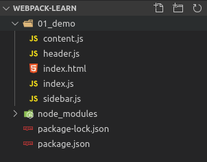
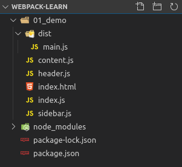
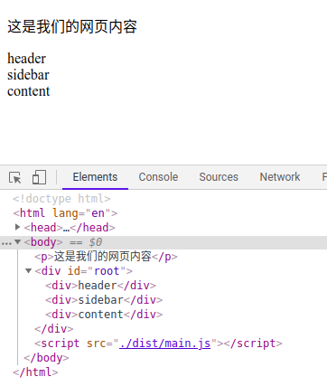

本章主要记录了webpack简单的配置入门，使用自定义配置来打包模块。

<!-- more -->

# webpack配置简单入门

# 一、默认配置与约定文件

> webpack默认有一个配置文件


上一章我们简单的使用了webapck对js文件进行打包，我们知道了webpack本质上是一个模块打包器。它会将模块化引入的模块全部打包到默认配置的文件中，也就是dist/main.js文件。

### 1、配置

webpack默认约定一个配置文件叫做：webpack.config.js，现在我们修改下项目结构如下：



通过上图，可以看到，我们将自己开发用到的源代码文件全部移入到新建的src目录下，并且在项目根目录下，新建了一个webpack配置文件为webpack.config.js文件。

```javascript
const path = require('path');

module.exports = {
    // entry: './src/index.js',
    entry:{
        main:'./src/index.js'
    },
    output: {
        filename: 'bundle.js',
        path:path.resolve(__dirname,'bundle')
    }
}
```

然后我们配置一下npm scripts如下：

```javascript
{
  "name": "webpack-learn",
  "version": "1.0.0",
  "description": "webpack-learn",
  "scripts": {
     "bundle":"webpack"
  },
  "keywords": [],
  "author": "ClearScenery",
  "license": "MIT",
  "devDependencies": {
    "webpack": "^4.41.0",
    "webpack-cli": "^3.3.9"
  }
}
```

这里我们只是配置了一个 **"bundle":"webpack" **脚本，当我们运行**npm run bundle**时，会自动调用webpack命令，webpack首先会在项目中查找webpack.config.js，如果找到就使用其中的配置，如果没找到就是用默认配置。
所以这里会按照我们配置文件中定义的入口文件来进行模块查找并打包到项目中bundle目录下，产生一个bundle.js文件。

说明：当配置npm script时，我们运行npm run bundle使用的webpack和npx webpack效果是一样的，都会首先在当前工程node_modules的bin目录下查找该命令，不同的是，如果没有此命令，npm run bundle会提示错误，而npx会从中央仓库下载。

### 2、日志输出说明

当我们运行npm run bundle，控制台打印出如下日志，接下来我们讲讲打印出的信息都是什么意思：



- hash：本次打包的哈希值
- version：本次打包使用的webapck版本
- time：本次打包耗时
- build at：打包时间

| asset | size | chunks | chunk names |
| --- | --- | --- | --- |
| 打包出的文件 | 打包出的文件大小 | 每一个文件的ID | 每一个文件的名字 |


- entrypoint：入口文件

同时，我们可以看到上图中的下面下方有一个警告，提示webapck没有配置mode。这个mode的意思是配置webpack打包的模式，有两个选项，一个是development，一个是production。见名知意，可以知道，当开发模式下，我们可以配置成development，生成环境下可以配置成production，接下来我们可以看下两者的区别。

接下来我们修改webapck文件，在其中添加mode为开发模式：

```javascript
module.exports = {
    mode:'development', //mode为开发模式
    entry:{
        main:'./src/index.js'
    },
    output: {
        filename: 'bundle.js',
        path:path.resolve(__dirname,'bundle')
    }
}
```

然后我们运行npm run bundle，这次我们会发现没有黄色的警告了。我们打开打包出的bundle.js，会发现代码大致长这样：




然后我们修改mode为生产模式：

```javascript
module.exports = {
    mode:'production', //mode为生产模式
    entry:{
        main:'./src/index.js'
    },
    output: {
        filename: 'bundle.js',
        path:path.resolve(__dirname,'bundle')
    }
}
```

然后再次运行npm run bundle重新打包，也没有警告，我们再次打开bundle.js，会发现代码大致如下：


比对两次产生的bundle.js可以发现，开发模式下，打包出的文件是没有进行压缩的，这样我们可以方便进行调试，而生成环境下，是会进行压缩，从而可以减少包体积，节省带宽等。

## 二、配置文件概述与loader介绍

### 1、配置文件概述

下面是一个webpack配置文件，接下我们简单介绍下其中的内容：

```javascript
const path = require('path');

module.exports = {
    mode:'production',
    entry:{
        main:'./src/index.js'
    },
    module: {
        rules:[
            {
                test:/\.jpg/ ,
                use:{
                    loader:'file-loader'
                }
            }
        ]
    },
    output: {
        filename: 'bundle.js',
        path:path.resolve(__dirname,'bundle')
    }
}
```

- require('path')：引入node核心path模块，用来处理系统路径
- module.exports = {}，Commonjs模块暴露规范写法，webpack配置文件走的也是Commonjs模块话规范
- mode：配置webpack的mode为production，生产模式
- entry：配置webpack的入口文件
- module：用来配置webpack的loader等，此处，配置了一条规则用来处理.jpg文件，使用了file-loader
- output：打包输出的文件，此处配置的文件名字为bundle.js，path配置为当前目录下的bundle目录下

### 2、loader简单使用

webpack默认情况下只是一个js模块打包器，当我们需要对非js文件打包时，我们就需要loader来处理这些文件，上面的配置中，我们配置了一个file-loader来处理jpg图片打包。在我们配置了file-loader之后，我们还不能直接进行打包，必须先安装file-loader，webpack才能使用它。

通过 `npm install file-loader -D` 来安装file-loader。

同时，我们修改index.js文件如下：

```javascript
import Header from './header.js';
import Sidebar from './sidebar.js';
import Content from './content.js';
import avater from './logo.jpg';

var img = new Image();
img.src=avater;

var root = document.getElementById('root');
root.append(img)

console.log(avater)

new Header();
new Sidebar();
new Content();
```

接下里我们运行下npm run bundle，打印的日志如下：


通过日志我们可以看到，logo.jpg已经被打包了，这时我们可以看到bundle目录下产生了一个jpg的文件。


此时，我们打开index.html，发现成功的渲染了一张图片：


通过此处，可以联想到vue中也是通过vue-loader来打包.vue等文件的。

本章简单的概述了webpack的配置文件，已经简单的介绍了loader的概念，接下了我会通过使用不同的loader来加深对loader的理解。
