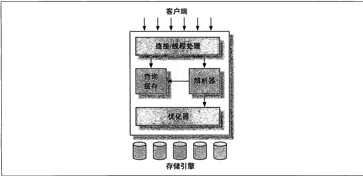
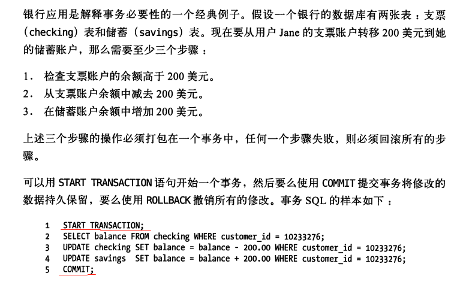
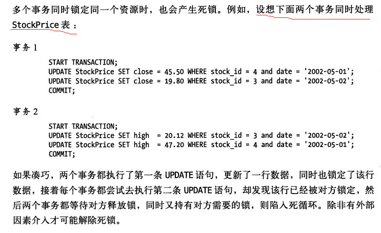

MySQL最重要、最与众不同的特性是它的存储引擎架构，这种架构的设计讲查询处理及其他系统任务和数据的存储/提取相分离。

<!-- more -->

## MySQL逻辑架构



+ 最上层的服务并不是MySQL独有的，大多数基于网络的客户端/服务端的工具或者服务都有类似的架构。比如链接处理、授权认证、安全等。
+ 第二层架构是MySQL比较有意思的部分。大多数MySQL的核心服务功能都在这一层，包括查询解析、分析、优化、缓存以及所有的内置函数（例如，日期、事件、数学和加密函数），所有跨存储引起的功能都在这一层实现：存储过程、触发器、视图等。
+ 第三次包含了存储引擎。存储引擎负责MySQL中数据的存储和提取。服务器通过API与存储引擎进行通信。这些接口屏蔽了不同存储引擎之间的差异，使得这些差异对上层的查询过程透明。存储引擎API包含几十个底层函数，用于执行诸如“开始一个事务”或者“根据主键提取一行记录”等操作。但存储引擎不会去解析SQL【InnoDB是例外，它会解析外键定义，因为MySQL服务器本身没有实现该功能】，不同存储引起之间也不会相互通信，知识简单地相应上层服务器的请求。


### 链接管理与安全性

每个客户端连接都会在服务器进程中拥有一个线程，这个链接的查询只会在这个单独的线程中执行，该线程会进行CPU轮转执行。服务器会负责缓存线程，不需要为每一个新建的的连接创建或者销毁线程。

当客户端连接到MySQL服务器时，服务器需要对其进行认证。认证基于用户名、原始主机信息和密码。如果使用了安全套接字（ssl）的方式连接，还可以使用X.509证书认证。一旦客户端连接成功，服务器会继续验证客户端是否具有执行某个特定查询的权限。


### 优化与执行

MySQL会解析查询，并创建内部数据结构（解析树），然后对其进行各种优化，包括：

+ 重写查询
+ 决定表的读取顺序
+ 选择合适的索引等

用户可以通过特殊的关键字（hint）提示优化器，影响它的决策过程。也可以请求优化器解释优化过程的各个因素，使用户可以知道服务器是如何进行优化决策的，并提供一个安靠基准，便于用户重构查询和Schema、修改相关配置，使其高效运行。


存储引擎对与优化器是由影响的。优化器会请求存储引擎提供容量或者；某个具体操作的开销，以及表数据的统计信息。


对于SELECT语句，在解析查询之前，服务器会先检查查询缓存，如果能够在其中找到对应的查询，就会直接返回缓存结果集，而不用再查询，优化和执行整个过程。


## 并发控制

只要有多个查询需要在同一个时刻修改数据，都会产生并发控制问题。MySQL在两个层面进行了并发控制：服务器层和存储引擎层。

共享锁：读锁

排他锁：写锁

MySQL是锁的内部管理都是透明的。


### 锁粒度

+ 加锁也消耗资源
  + 锁的各种操作，包括获得锁、检查锁是否已经接触、释放锁等，都会增加系统开销。
+ 锁策略，就是在锁的开销和数据的安全性之间寻求平衡，这种平衡当然也会影响到性能。
+ MySQL支持多个存储引擎的架构，所以不需要单一的通用解决方案。

### 表锁

+ 锁定整张表
+ 有写锁时其他用户不能读写
+ 读锁不互相阻塞
+ 开销小
+ 在诸如READ LOCAL表锁某些类型并发写操作中也有良好的性能
+ 写锁比读锁优先级高，可能会被插入到读锁队列前面
+ 尽管存储引擎可以管理自己的锁，MySQL本身还是会使用各种有效的表锁来实现不同的目的。例如，服务器会为诸如ALTER TABLE之类的语句使用表锁，而忽略存储引擎的锁机制。


### 行锁

+ 行级锁可以最大程度的支持并发处理（同时也带了最大的锁开销）。

+ InnoDB和XtraDB，以及其他一些存储引擎中实现了行级锁。

+ 行级锁只在存储引擎层实现，而MySQL服务器层没有实现。

+ 所有的存储引擎都以自己的方式显示了锁机制。

  

## 事务

事务就是一组原子性的SQL查询，或者说一个独立的工作单位。如果数据库引擎能够成功地对数据库应用该组查询的全部语句，那么就执行该组查询。如果其中有任何一条语句因为崩溃或其他原因无法继续执行，那么所有的语句都不会执行。也就是说，事务内的语句，要么全部执行成功，要么全部执行失败。



### ACID特性

除非系统通过严格的ACID测试，否则空谈事务的概念是不够的。

+ 原子性（atomicity）：一个事务被视为一个不可分割的最小工作单元，整个事务的所有操作要么全部提交成功，要么失败回滚。
+ 一致性（consistency）：数据库总是从一个一致性状态转换到另外一个一致性状态。
+ 隔离性（isolation）：**通常来说**，一个事务所做的修改在最终提交以前，对其他事务时不可见的。

+ 持久性（durability）：一旦事务提交，则其所做的修改就会永久保存到数据库中。持久性时个有点模糊的概念。实际上持久性也分为很多不同的级别，不可能有100%的持久性策略。可以根据不同的业务选择不同的存储引擎。

### 隔离级别

隔离性其实比想象的要复杂。在SQL标准中定义了四种隔离级别，每一种级别都规定了一个事务所做的修改，哪些在事务内和事务间时可见的，哪些是不可见的。


每种存储引擎实现的隔离级别不尽相同。如果熟悉其他的数据库产品，可能会发现某些特性和你期望的会有些不一样。


简单的介绍一下四种隔离级别：

+ READ UNCOMMITTED（读未提交）
  + 在READ UNCOMMITTED级别，事务中的修改，即使没有提交，对其他事务也都是可见的。事务可以读取未提交的数据，这也被称为脏读（Dirty Read）。这个级别会导致很多问题，从性能上来说，READ UNCOMMITTED不会比其他的级别好太多，一般不经常使用。
+ READ COMMITTED（读提交）
  + 大多数数据库系统的默认隔离级别都是READ COMMITTED（但MySQL不是）。READ COMMITTED满足前面提到的隔离性的简单定义：一个事务开始时，只能“看见”已经提交的事务所作的修改。这个级别有时候也叫做不可重复读，因为两次执行同样的查询，可能得到不一样的结果。
  + 读提交是Oracle的默认隔离级别。
+ REPEATABLE READ（可重复读）
  + REPEATABLE READ解决了脏读的问题，该级别保证了在同一个事务中多次读取同样记录的结果时一致的。但是理论上，可重复读还是无法解决另一个幻读（Phantom Read）的问题。所谓幻读，指的是当某个事务在读取某个范围的记录时，另外一个事务又在该范围内插入新的记录，当之前的事务再次读取该范围的记录时，会产生幻行（Phantom Row）。InnoDB和XtraDB存储引擎通过多版本并发控制（MVCC，Mutiversion Concurrrency Control）解决了幻读的问题。
  + 可重复读时MySQL的默认隔离级别。
+ SERIALIZABLE（可串行化）
  + SERIALIZABLE是最高的隔离级别。它通过强制事务串行执行，避免了前面说的幻读的问题。简单来说，SERIALIZABLE会在读取的每一行数据上都枷锁，可能会导致大量的超时和锁争用的问题。实际应用也很少用到这个隔离级别，只有在非常需要确保数据的一致性而且可以接受没有并发的情况下，才考虑采用该级别。


|     隔离级别     | 脏读可能性 | 不可重复读可能性 | 幻读可能性 | 加锁读 |
| :--------------: | :--------: | :--------------: | :--------: | :----: |
| READ UNCOMMITTED |     Y      |        Y         |     Y      |   N    |
|  READ COMMITTED  |     N      |        Y         |     Y      |   N    |
| REPEATABLE READ  |     N      |        N         |     Y      |   N    |
|   SERIALIZABLE   |     N      |        N         |     N      |   Y    |


### 死锁

死锁是指两个或者多个事务在同一资源上相互占用，并请求锁定对方占用的资源，从而导致恶性循环的现象。当多个事务试图以不同的顺序锁定资源时，就可能会产生死锁。多个事务同时锁定同一个资源时，也会产生死锁。



> 死锁解决

+ InnoDB存储引擎检测到死锁的循环依赖，会返回一个错误，并将持有最少行级排他锁的事务进行回滚（这是相对比较简单的死锁回滚算法）。
+ 当查询锁等待超时的设定后放弃锁请求，这种方式通常来说不好。


### 事务日志

事务日志可以帮助提高事务的效率。存储引擎在修改表的数据时只需要修改其内存拷贝，再把该修改行为记录到持久在硬盘上的事务日志中，而不用每次都将修改的数据本身持久到硬盘。

事务日志采用追加的方式，类似与Redis的AOF，因此写日志的操作时硬盘上一小块区域内的顺序I/O（局部性原理），不用像随机IO需要再磁盘的多个地方移动磁头，所以采用事务日志的方式相对来说要快的多。

事务日志持久以后，内存中的数据可以再后台慢慢刷回到磁盘。目前大多数存储引擎都是这样实现的，我们通常称之为预写式日志，修改数据需要写两次磁盘。

如果事务日志持久化之后，系统崩溃，存储引擎再重启时能够自动恢复这部分修改的数据。具体回复方式视存储引擎而定。


### MySQL中的事务

MySQL提供了两种事务型的存储引擎：InnoDB和NDB Cluster。另外还有一些第三方存储引擎也支持事务，比较知名的包括XtraDB和PBXT。


自动提交（AUTOCOMMIT）

MySQL默认采用自动提交模式。也就是，如果不是显示开始某一个事务，则每个查询都被当做一个事务执行提交操作。在当前连接中，可以通过设置AUTOCOMMIT变量来启用或者禁用自动提交模式：

```mysql
show variables like 'AUTOCOMMIT'
```

1或者ON表示启用，0或者OFF表示禁用。当AUTOCOMMIT=0时，所有的查询都是在一个事务中，直到显示地执行COMMIT提交或者ROLLBACK回滚，该事务结束，同时又开始了另一个事务。

对于MyISAM或者内存表，不会有任何影响，对这类表来说，没有COMMIT或者ROLLBACK的概念。

有些命令会在执行之前强制执行COMMIT提交当前活动事务。典型如DDL，比如ALTER TABLE，大量改变数据的操作。另外还有LOCK TABLES等其他语句也会导致同样的问题。

MySQL可以通过执行SET TRANSACTION ISOLATION LEVEL命令来设置隔离级别。新的隔离级别会在下一个事务开始的时候生效。可以在配置文件中设置整个数据库的隔离级别，也可以只改变当前会话的隔离级别：

```mysql
SET SESSION TRANSACTION ISOLATION LEVEL READ COMMITTED
```

MySQL能够识别所有的4个ANSI隔离级别，InnoDB引擎也支持所有的隔离级别。


#### 隐式和显示锁定

InnoDB采用的是两阶段锁定协议。在事务执行过程中，随时都可以执行锁定，锁只有在执行COMMIT或者ROLLBACK的时候才会释放，并且所有的锁都在同一时刻被释放。前面描述的锁定都是隐式锁定，并且所有的锁是在同一时刻被释放。前面描述的锁定都是隐式锁定，InnoDB会根据隔离级别在需要的时候自动枷锁。

另外，InnoDB也支持通过特定的语句进行显示锁定，这些语句不属于SQL规范。

+ SELECT ... LOCK IN SHARE MODE
+ SELECT ... FOR UPDATE

MySQL也支持LOCK TABLES和UNLOCK TABLES语句，这是在服务层实现的，和存储引擎无关。他们有自己的用途，但并不能代替事务处理。如果应用需要用到事务，还是应该选择事务型存储引擎。

建议：除了事务中禁用了AUTOCOMMIT，可以使用LOCK TABLES之外，其他时候不要显示的使用LOCK TABLES，不管使用的事什么存储引擎。


## 多版本并发控制

MySQL的大多数事务型存储引擎实现的都不是简单的行级锁。基于提升并发性能的考虑，它们一般都实现了多版本并发控制（MVCC）。只不过其他数据库实现机制不同，因为MVCC没有统一标准。

可以认为MVCC是行级锁的一个变种，但是它在很多情况下避免了加锁操作，因此开销更低。虽然实现机制有所不同，但大都实现了非阻塞的读操作，写操作也知识锁定必要的行。

MVCC只在REPEATABLE READ和READ COMMITTED两个隔离级别下工作。其他两个级别都和MVCC不兼容，因为READ UNCOMMITTED总是读取最新的数据行，而不是符合当前事务版本的数据行，而SERIALIZABLE则会对所有读取的行都加锁。


<Vssue :title="$title" />